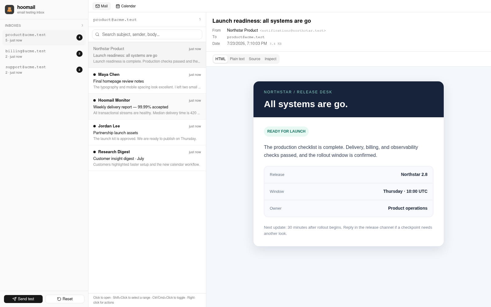

<p align="center">
  
</p>

<p align="center">
  <a href="https://github.com/openhoo/hoomail/actions/workflows/ci.yml"></a>
  <a href="https://github.com/openhoo/hoomail/releases"></a>
  <a href="https://hub.docker.com/r/openhoo/hoomail"></a>
  <a href="LICENSE"></a>
</p>

Hoomail is a small, self-hosted email testing server. Point an application at its SMTP port, then inspect captured messages in a real-time web inbox or retrieve them over POP3.

One static Go binary serves SMTP, POP3, the JSON API, server-sent events, and an embedded Preact interface. SQLite stores the captured raw MIME, parsed message data, attachment bytes, read state, and reconciled calendar state.

<p align="center">
  
</p>

## Features

- Catch mail without pre-creating inboxes. Each unique SMTP envelope recipient (`RCPT TO`) receives a normalized lowercase inbox, including BCC recipients.
- Inspect captured messages with a deterministic offline report: summary counts, grouped standards/recommendation/heuristic findings with evidence, aggregated links and images, and a wire-order MIME tree with raw and decoded sizes. Partial or truncated reports identify unavailable analysis instead of implying success. Hoomail does not verify DNS, SPF, DKIM, DMARC, ARC custody, reputation, SMTP transport, delivery, or unsubscribe endpoints. Standards-valid HTML and plain-text previews remain sender-faithful within the parsed security allowlist; Hoomail is not a pixel-perfect Outlook or Gmail emulator.
- Select MIME alternatives and related resources according to their multipart structure: selected HTML can retain the nearest earlier plain-text fallback, unselected alternatives contribute no ordinary attachments, and recognized calendar parts remain available for invite/calendar extraction. Decode common character sets and render matching inline CID images only from the selected related resources represented by parser storage. Remote content and active markup are blocked by default. A conservative raster/text attachment allowlist can be previewed; PDF and active formats are download-only.
- Parse calendar parts and reconcile `PUBLISH`, `REQUEST`, `CANCEL`, and `REPLY` messages by event UID, sequence, cancellation state, and attendee participation.
- Refresh mailbox counts, message lists, searches, and calendars through server-sent events.
- Search within the selected inbox by subject, sender name/address, or plain-text body; mark messages read or unread, multi-select them, or delete them.
- Read and delete captured mail through POP3.
- Persist data in one logical SQLite database. WAL mode can create `-wal` and `-shm` sidecar files beside the configured database file.
- Run as a non-root `linux/amd64` or `linux/arm64` container, or deploy with the included footprint-first Helm chart.

## Email inspection

Inspection is on demand. Receiving a message, listing an inbox, opening a message, or viewing its HTML/text content does not run the inspector. Select the **Inspect** tab—or call `GET /api/messages/{id}/inspect`—to analyze that message. Inspection does not mark the message as read.

Each endpoint request analyzes the stored message locally from its raw MIME bytes and parsed fallback content. Reports are not written to SQLite, and inspection performs no DNS or HTTP requests. Authentication, reputation, delivery, and unsubscribe checks that require external data are therefore reported as unverified or not evaluated rather than guessed.

The web interface caches completed reports in memory and reuses them when an inspected message is reopened. It retains up to eight inactive inspection reports; active and in-flight reports are not evicted. Older reports can be analyzed again after eviction, page reload, or browser restart. **Retry** discards the cached result and requests a fresh analysis. Direct API calls always run a fresh analysis because the server does not cache reports.

Reports are deterministic and versioned. They include analysis completeness, severity counts, evidence-backed findings, discovered links and images, and the MIME tree. Safety limits can produce a partial or truncated report; those states identify what could not be analyzed instead of treating missing analysis as a pass.

## Quick start

The release image runs as UID/GID `65532`. Initialize a named volume once so the non-root process can write the database:

```bash
docker volume create hoomail-data
docker run --rm \
  -v hoomail-data:/data \
  alpine:3.22 \
  chown 65532:65532 /data
```

Start Hoomail:

```bash
docker run -d \
  --name hoomail \
  --restart unless-stopped \
  -p 127.0.0.1:3000:3000 \
  -p 127.0.0.1:2525:2525 \
  -p 127.0.0.1:3110:3110 \
  -v hoomail-data:/app/data \
  ghcr.io/openhoo/hoomail:latest
```

These mappings are loopback-only by default. Deliberate non-loopback exposure requires a trusted, firewalled network.

Open [http://localhost:3000](http://localhost:3000).

Configure the application under test:

| Setting | Value |
| --- | --- |
| SMTP host | `localhost` |
| SMTP port | `2525` |
| Encryption | None |
| Authentication | None |

Hoomail advertises an SMTP size limit of 25 MiB (`26214400` bytes). A larger declared or received message is rejected with SMTP `552` and is not stored.

To send a sample through Hoomail's own SMTP listener:

```bash
curl --fail-with-body \
  --request POST \
  --header 'Content-Type: application/json' \
  --data '{"to":"developer@example.test","kind":"plain"}' \
  http://localhost:3000/api/send-test
```

Named sample kinds are `plain`, `invite`, `update`, and `cancellation`; a missing or unrecognized kind falls back to `plain`. The `plain` sample contains plain-text and HTML alternatives plus a small text attachment. The calendar samples share a stable per-recipient UID so invite, update, and cancellation exercise calendar reconciliation.

## Guides

- [Runtime and configuration](docs/runtime.md) — commands, environment variables, startup, shutdown, health checks, and static serving
- [HTTP API and events](docs/http-api.md) — endpoint schemas, errors, side effects, attachment responses, and SSE delivery
- [SMTP, MIME, and POP3](docs/mail-protocols.md) — envelope handling, limits, MIME selection, attachment rules, and POP3 semantics
- [Data and calendar](docs/data-and-calendar.md) — SQLite lifecycle, stored data, search, cascades, reset behavior, and iCalendar reconciliation
- [User interface](docs/user-interface.md) — inbox navigation, message views, attachment previews, calendar behavior, keyboard controls, and limitations
- [Deployment](docs/deployment.md) — container images, image verification, persistence, Helm values, networking, probes, and release operations
- [Development](docs/development.md) — toolchains, build prerequisites, tests, benchmarks, Vite limitations, and CI

## Container images

The same multi-platform release image is published to both registries with BuildKit SBOM and provenance attestations:

- `ghcr.io/openhoo/hoomail`
- `openhoo/hoomail` on [Docker Hub](https://hub.docker.com/r/openhoo/hoomail)

A GitHub artifact attestation is additionally published for the GHCR image digest. Releases publish an exact semantic-version tag, a moving `major.minor` tag, `sha-<7-character-release-commit>`, and `latest`. For reproducible deployments, pin an exact version or image digest rather than a moving tag.

The scratch image contains the compiled Hoomail server and runs as UID/GID `65532`. `/app/data` must be writable by that identity.

The in-image `/hoomail healthcheck` command requires:

- HTTP `200` from `/api/mailboxes`
- an accepted SMTP TCP connection
- a POP3 greeting beginning with `+OK`

Docker runs that command every 30 seconds with a 3-second timeout, 3-second start period, and three retries. Inspect the result with:

```bash
docker inspect --format '{{.State.Health.Status}}' hoomail
```

Print the embedded version without starting the services:

```bash
docker run --rm ghcr.io/openhoo/hoomail:latest version
```

## Configuration

Empty environment values use the corresponding defaults.

| Environment variable | Binary default | Release-container default | Purpose |
| --- | --- | --- | --- |
| `PORT` | `3000` | `3000` | Web interface and HTTP API listener |
| `HOOMAIL_SMTP_PORT` | `2525` | `2525` | SMTP listener |
| `HOOMAIL_POP3_PORT` | `3110` | `3110` | POP3 listener |
| `HOOMAIL_DB_PATH` | `data/hoomail.db` | `/app/data/hoomail.db` | SQLite database path |
| `HOOMAIL_HEALTHCHECK_HOST` | `127.0.0.1` | `127.0.0.1` | Host probed by `hoomail healthcheck` |

The three service listeners bind on every interface. If you change a container listener port, map the same in-container port; for example, use `-e HOOMAIL_SMTP_PORT=2526 -p 2526:2526`. Dockerfile `EXPOSE` entries are metadata and do not remap ports.

## POP3

Connect to port `3110` and use the inbox address as the username. Opening a missing inbox creates an empty normalized mailbox. Hoomail accepts any password because it is a development mail catcher, not an authentication service.

Supported commands are `CAPA`, `USER`, `PASS`, `STAT`, `LIST`, `UIDL`, `RETR`, `TOP`, `DELE`, `RSET`, `NOOP`, and `QUIT`. POP3 deletions are committed only by `QUIT`; disconnecting first retains the messages. See [SMTP, MIME, and POP3](docs/mail-protocols.md) for the full protocol contract.

## Kubernetes with Helm

Install from a checkout:

```bash
helm upgrade --install hoomail ./charts/hoomail \
  --namespace hoomail \
  --create-namespace
```

The chart permits exactly one replica and uses a `Recreate` rollout to avoid overlapping writers to SQLite, so upgrades can cause brief downtime. Defaults include:

- a chart-version-tagged GHCR image with `IfNotPresent` pull policy; an image digest, when set, takes precedence over the tag
- a generated 256 MiB `ReadWriteOnce` PVC using the cluster's default StorageClass
- one `ClusterIP` Service containing HTTP, SMTP, and POP3 ports
- HTTP-only Kubernetes Ingress, disabled by default
- CPU/memory requests of `5m`/`16Mi`, a `64Mi` memory limit, and no CPU limit
- startup, readiness, and liveness exec probes that run the built-in three-listener health check
- UID/GID/fsGroup `65532`, a read-only root filesystem, no added capabilities or privilege escalation, `RuntimeDefault` seccomp, and no service-account token mount

Set `persistence.existingClaim` to reuse a PVC that is writable by UID/GID `65532`. Setting `persistence.enabled=false` uses `emptyDir`, so all captured data is lost when the Pod is replaced.

The chart-created Ingress routes HTTP only. Changing the shared Service to `LoadBalancer` or `NodePort` exposes all three Service ports together. SMTP/POP3 through an ingress controller requires controller-specific TCP-stream configuration outside this chart; separate exposure policies require additional Services or chart customization.

Run the basic in-cluster listener check after installation:

```bash
helm test hoomail --namespace hoomail --logs
```

This health test does not send mail or verify persistence, Ingress, or external connectivity. See [Deployment](docs/deployment.md) and [`charts/hoomail/values.yaml`](charts/hoomail/values.yaml) for the complete operational contract.

## Local development

Use the project/CI toolchains:

- Bun 1.3.14
- Go 1.26.5
- Playwright-managed Chromium for end-to-end tests

`web/dist` is generated and gitignored, but Go embeds it at compile time. After a fresh checkout and after frontend changes, build the client before running any Go command that compiles the server:

```bash
bun install --frozen-lockfile
bun run build
go run ./cmd/hoomail
```

The interface is available at `http://localhost:3000`; SMTP listens on `2525`, POP3 on `3110`, and a checkout stores data at `./data/hoomail.db` unless `HOOMAIL_DB_PATH` is set.

Common local checks:

```bash
bun x tsc --noEmit
bun run build
go test -race ./...
bun x playwright install chromium
bun run test:e2e
helm lint --strict charts/hoomail
```

`bun run test:e2e` rebuilds the client and Go binary, then uses an isolated disposable database and server. `bun run bench:frontend` uses the same harness for the large-list Chromium benchmark.

`bun run dev` and `bun run preview` serve only Vite output. The repository configures no Vite proxy, so same-origin `/api/*` and `/api/events` requests are not forwarded to a separately running Hoomail server. Use the embedded build/run workflow for an integrated application, or provide an external same-origin reverse proxy. See [Development](docs/development.md) for the complete workflow.

## HTTP API overview

| Method | Path | Purpose |
| --- | --- | --- |
| `GET` | `/api/mailboxes` | List inboxes and counts |
| `DELETE` | `/api/mailboxes/{id}` | Delete an inbox and its messages, attachments, and calendar state |
| `GET` | `/api/mailboxes/{id}/messages` | List messages; `?q=` searches subject, sender, and plain-text body within that inbox |
| `GET` | `/api/mailboxes/{id}/events` | List reconciled calendar events for an inbox |
| `GET` | `/api/messages/{id}` | Get parsed message details; first retrieval also marks an unread message read |
| `GET` | `/api/messages/{id}/inspect` | Get the versioned offline inspection report with analysis state, summary, grouped findings, resources, and MIME structure |
| `POST` | `/api/messages/actions` | Delete messages or mark IDs read/unread |
| `GET` | `/api/attachments/{id}` | Serve a conservative raster-image/plain-text allowlist inline with `nosniff`; PDF and active formats download only; `?download=1` forces download |
| `GET` | `/api/events` | Subscribe to the best-effort, non-replayable SSE invalidation stream |
| `POST` | `/api/send-test` | Generate a built-in message through the local SMTP listener |
| `POST` | `/api/reset` | Irreversibly delete all stored data and reset generated ID sequences |

See [HTTP API and events](docs/http-api.md) for request/response schemas, status codes, mixed JSON/plain-text errors, mutation side effects, attachment behavior, and exact SSE payloads.

## Architecture

```text
application under test
        │ SMTP :2525
        ▼
 MIME parser ──► SQLite ──► HTTP API + SSE ──► Preact UI :3000
                    │
                    └────────────────────────► POP3 :3110
```

The release container is a scratch image containing the compiled server. The Vite bundle in `web/dist` is embedded into the Go binary at compile time. Browser navigation uses a GET/HEAD SPA fallback. The exact API routes listed above are supported; other API-shaped requests can return `404`, while malformed dynamic route shapes may reach endpoint validation and return validation errors.

## Security

Hoomail has no SMTP, POP3, or web authentication, no TLS, and no CSRF protection. Its HTTP server does not provide an application-wide browser-security-header policy, and destructive API endpoints are available to every caller that can reach the service. Message frames receive their own CSP/referrer restrictions, and attachment responses receive `nosniff`. Hoomail stores full message content and attachment bytes.

HTML previews are processed by a parsed allowlist and displayed in a sandboxed frame. Safe sender formatting—including email tables, ordinary typography, colors, spacing, and conservative inline CSS—is retained; scripts, active embeds, network-capable CSS, and remote subresources are removed. CID images resolve only from captured resources scoped to the selected multipart/related content represented by parser storage. The frame adds only security and containment rules: maximum-width containment, browser-default body margin with no Hoomail margin override, responsive image maximum width, CSP, and no-referrer—not Hoomail typography, colors, link styling, or padding. Attachment responses use `X-Content-Type-Options: nosniff`; only PNG, JPEG, GIF, WebP, plain text, and CSV are inline-capable, while PDF, HTML, SVG/XML, JavaScript, and other active or unknown formats are download-only. The app follows the browser/operating-system light or dark preference, while the isolated message canvas remains white unless safe sender styling changes it; Hoomail does not recolor message content to match the app. These security and containment choices are distinct from sender HTML standards validity and visual compatibility with particular mail clients. Run Hoomail only on a trusted development network or behind a reverse proxy that provides TLS, authentication, and an appropriate browser-header policy. Do not expose its ports directly to the public internet, share its origin with trusted applications, or use it as a production mail server.

HTML email itself—including elaborate table layouts and inline styling—is standards-valid. Visual support still differs among clients, so Hoomail shows the safe sender-authored result rather than claiming Outlook/Gmail rendering parity. See [RFC 2854](https://www.rfc-editor.org/rfc/rfc2854), [Gmail's CSS guidance](https://developers.google.com/gmail/design/css), and [Microsoft's Outlook HTML/CSS guidance](https://learn.microsoft.com/en-us/previous-versions/office/developer/office-2007/aa338201(v=office.12)) for the distinction between MIME validity and client compatibility.

## Brand assets

The square registry artwork is available at [`docs/assets/hoomail-registry-logo.png`](docs/assets/hoomail-registry-logo.png). The README banner is at [`docs/assets/hoomail-banner.png`](docs/assets/hoomail-banner.png).

## License

Hoomail is licensed under the [Apache License 2.0](LICENSE).
